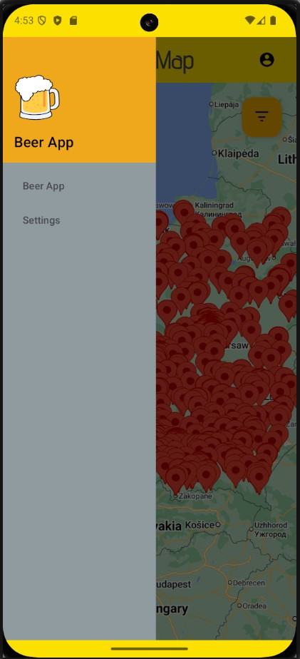
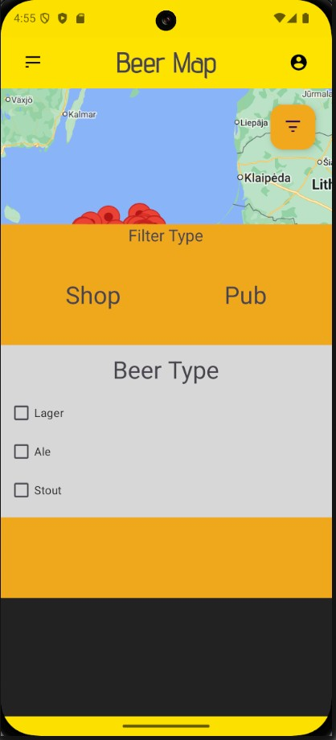
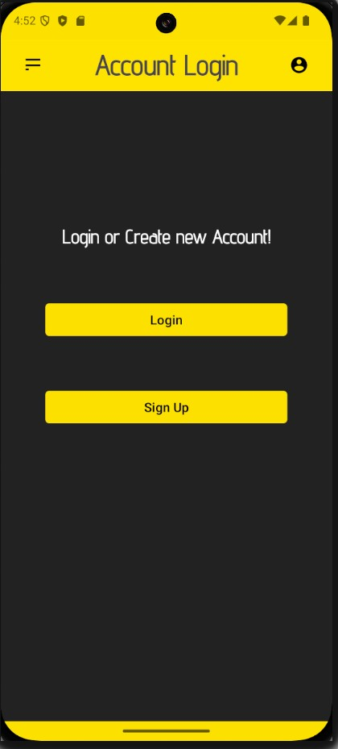
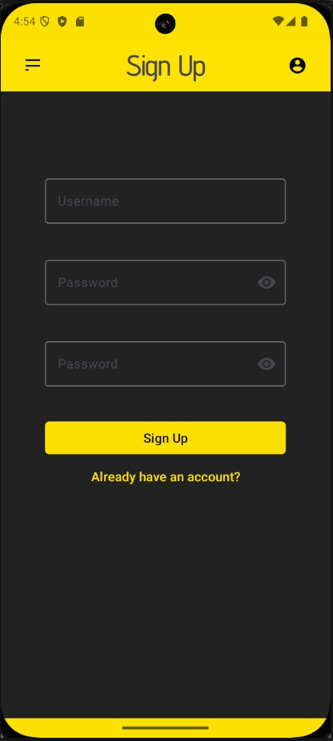
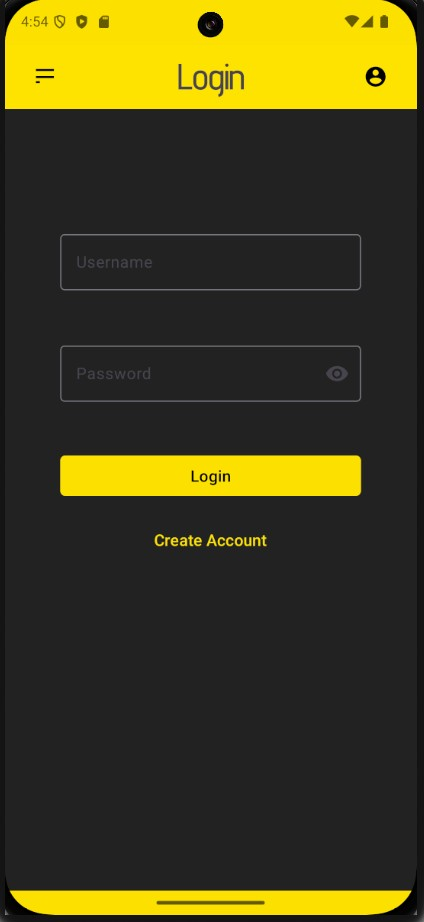

# Beer App 🍻

Beer App is an Android application built with Kotlin and Android Studio. It features an interactive UI with login functionality and a map displaying bars. Currently, the map points are hardcoded, but future updates will include dynamic location fetching.

 

 

 

## Features ✨
- 📍 Interactive map displaying bar locations
- 🔐 User authentication with login functionality
- 🖥️ Clean and modern UI
- 🚀 Built using Kotlin and Android Studio

## Future Improvements 🔮
- Fetching bar locations dynamically from an API or database
- User reviews and ratings for bars
- Favorites list for users
- Improved UI/UX

## Technologies Used 🏗
- Kotlin
- Android Studio
- Google Maps API (for future dynamic location fetching)

